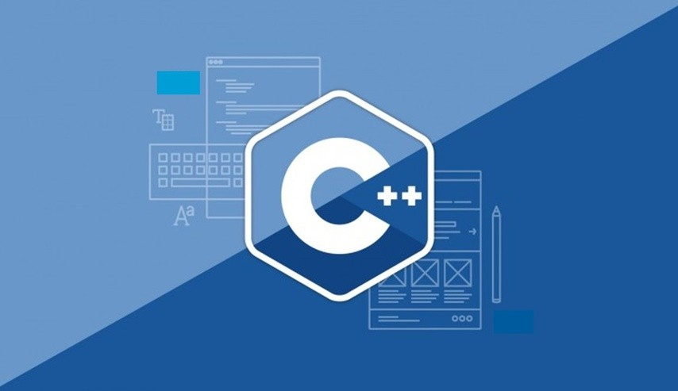

<h1 align="center">
  
</h1>

# C++ Programming [OOPS Concept]

[Object Oriented Programming]

“Object-oriented programming is an approach that provides a way of modularizing programs by
creating partitioned memory areas for both data and functions that can be used as templates for
creating copies of such modules on demand”.
